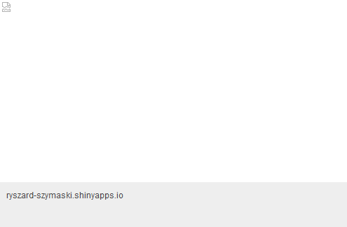
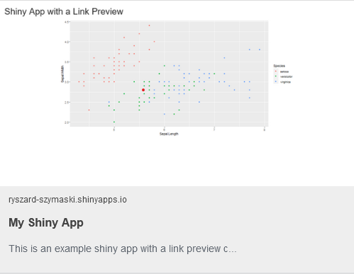

# shiny_app_link_preview

Do you know that nice link preview you get whenever you share a link on social media? Unfortunately, by default when sharing a Shiny app you won't get such a link preview.

However, it turns out that you can easily configure your shiny app in a way that providing its link will result in a link preview with the title, image and description you want!

This repository provides an example of such configuration - you can find the relevant source code in [app.R](./app.R). It makes use of the [Open Graph Protocol](https://ogp.me/) and [Twitter Cards](https://developer.twitter.com/en/docs/twitter-for-websites/cards/guides/getting-started) to enhance the url of your shiny app when you share it!

> If you are looking for a more user friendly way of configuring those meta tags for different platforms. Have a look at [metathis](https://github.com/gadenbuie/metathis)!

| Without Link Preview Configured | With Link Preview Configured |
| ------------------------------- | ---------------------------- |
|  |                    |

> **Important:** The preview won't work on Twitter as [shinyapps defines a global robots.txt which blocks all web crawrlers](https://github.com/gadenbuie/metathis/issues/11). 